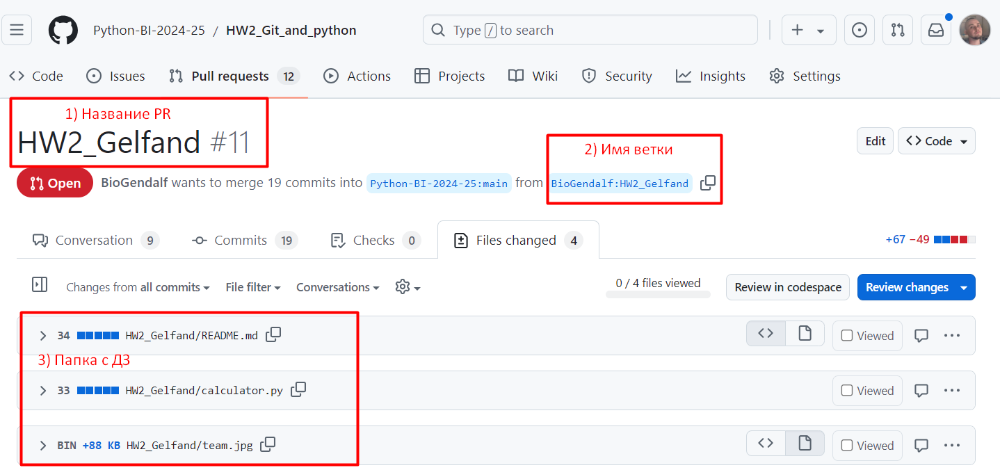

HW2_Arnaut

# Simple Decimal Calculator

This project is a basic command-line calculator implemented in Python.
It uses the `Decimal` class from Python's built-in `decimal` module to ensure precise arithmetic operations and avoid floating-point inaccuracies.

## Features

* **Addition** (`+`)
* **Subtraction** (`-`)
* **Multiplication** (`*`)
* **Division** (`/`) with zero-division protection

## How It Works

1. The program prompts the user to input an expression in the format:

   ```
   number operator number
   ```

   Example:

   ```
   6 / 3
   ```

2. The input is split into three elements:

   * First number (`a`)
   * Operator (`+`, `-`, `*`, `/`)
   * Second number (`b`)

3. The corresponding function (`plus`, `minus`, `product`, or `divide`) is executed.

4. The result is returned as a `Decimal` object.

## Example Usage

```
Input:   6 / 3
Output:  Decimal('2')
```

## Authors

* Oleg Arnaut - teamlead, added main function
* Alevtina Pinova - added minus function
* Elina Iskhakova - added plus function and wrote README file
* Elena Parshina - added product function
* Arseniy Gubler - added divide function


